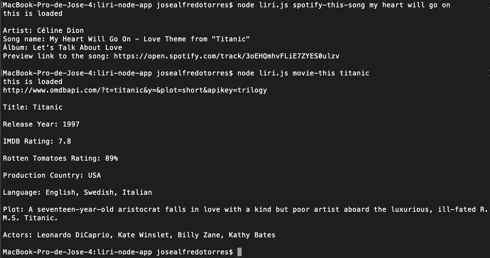
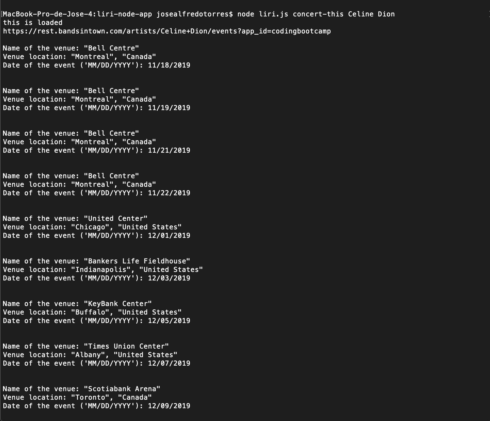
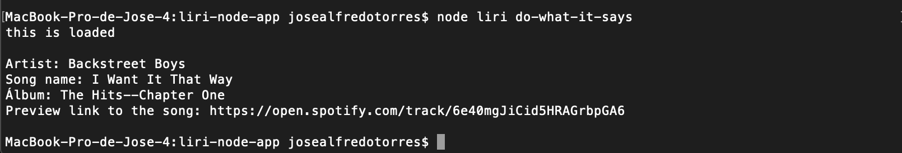

# liri-node-app

Liri is a program that emulates a virtual assistant like iphone's 'Siri', but Liri is a Language Interpretation and Recognition Interface that responds according to different parameters:
- 'movie-this' - For searching movies info
- 'concert-this' - To check your favorite artist's concerts info
- 'spotify-this-song' - To search for data about any song
- 'do-what-it-says' - Read files with any parameter

In order to use the program, first you need to clone it from Github to somewhere in your computer.
Then, inside the root folder of 'AmazonLike_Storefront', create a .env file with: 

            # Spotify API keys

            SPOTIFY_ID=Your-client-id
            SPOTIFY_SECRET=Secret-number

            OMDB_APIKEY=Api-key-number

            BANDSINTOWN_APIKEY=Api-key-number

To get your spotify id and secret number you will need to go: https://developer.spotify.com/my-applications/#!/

After that you will need to open the 'terminal' and write '$ npm install' to download the required packages.

Once that you are all set, you can start using the program.

To start the program you will need to write this lines in the terminal, depending of what you prefer to obtain as a response:

- Search movies info:
    node liri.js movie-this titanic
- Search concerts info:
    node liri.js concert-this Celine Dion
- Search spotify songs:
    node liri.js spotify-this-song My heart will go on
- Read from the file:
    node liri.js do-what-it-says

Required technologies:
Node.js
Javascript
Visual Studio Code